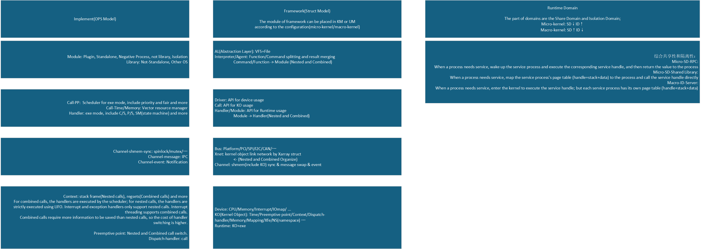

# Lynix 内核

## 概述

nixLayer内核基于结构分层概念来管理真实设备，静态内核对象以及运行时对象。如下图所示：

该内核目标是在用户态/特权态/安全态可以运行，并管理硬件和抽象资源。

## 结构分层

1. 真实设备(driver目录)：device|bus|driver|platform<bus/device/driver>
2. 静态内核对象(object目录)：ko|klink|kcall|xnet<klink/ko/kcall>
3. 运行时对象(runtime目录)：thread|channel|mod|channel_cs/channel_ps<channel/thread/mod>

## 真实设备定义

现目的是，简化Linux的驱动框架，删除sysfs，保留最基本的of库和bus/driver/device结构模型。

> Linux驱动简化案例：xvisor/drivers，xvisor/libs/vfs

> Linux用户态驱动案例：dpdk

### bus/driver/device结构模型

of库的作用是blob(fdt)解析为device_node+property；device_node以设备树的形式存在，每一个device_node包含一个property链表。
链表上的每一个property节点包含一个键值对<name, value>。

device_node存在fwnode_handle，fwnode_handle包含一个ops，相当于device_node的方法，同时包含两个链表suppliers和consumers，
用来处理fdt定义的兄弟依赖关系fwnode_link。

of库定义了device的初始化流程；一是解析fdt，填充设备树结构；二是创建platform_device和其他设备，platform_device中包含了device结构。

fdt /下的一级节点是bus，二级及叶子节点是device。
platform_device的创建依赖于compatible集合 {simple-bus，simple-mfd，isa，arm,amba-bus}。
也就是说，fdt /下的一级节点中compatible符合上述的，都是作为platform bus_type，剩下的设备归为其他bus_type，包括memory/reserved-memory/pcie/cpus/psci等；
platform bus_type包含soc/amba/firmware等。
二级及叶子节点通常包含pinctl, uart, gpio, timer, interrupt-ctl, clk, eth, dma, spi, wdt, pcie, mailbox, smmu, emmc, ufs, usb, i2c等

在platfrom_device创建过程中，会从fdt /路径下获取根节点of_root(device_node)，遍历子节点，即一级节点，找到bus(device_node)。
然后，创建bus(device_node)对应的plafrom_device，并填充plafrom_device基本结构，值得注意的是resource table，填充其irq和reg。
将已创建的plafrom_device加入到对应的bus klist上，处理fwnode_link，并由bus probe该platform_device。
接着，遍历bus下的子节点，即二级节点，找到device(device_node)。递归重复上述的过程。
值得注意的是，二级及叶子节点如果没有compatible property，会终止创建过程（在strict为true的情况下）

bus_type结构分两层，一是name+ops，二是subsys_private。在subsys_private中，包含两个klist，klist_devices和klist_drivers。
也就是说，每一类bus_type会将所属的device和driver链接上。
class与bus_type类似。
值得注意是，bus_type包含dev_root，保存device树的根节点。

device_driver结构分两层，一是name+match+ops，二是driver_private。在driver_private中，包含一个klist和一个klist_node。
klist_devices意思是，每一个device_driver会将对应的device链接上，即driver:device=1:N。
klist_bus意思是，device_driver挂载到对应bus_type的节点。
值得注意的是，device_driver包含bus，保存device_driver所属的bus_type。

device结构包含以下几层：
1. name+ops
2. device_private
3. 指向父节点的parent(of 初始化赋值)，指向所属的bus_type，指向所属的device_driver，指向所属的class
4. 私有数据 platform_data(of 初始化赋值)和driver_data(driver probe过程赋值)
5. device_node和dev_links_info，dev_links_info定义兄弟device的依赖关系，与fwnode_link类似
6. devres_head，包含一个device resource的链表

在device_private结构中，有一个klist和四个klist_node。
klist_children用于父节点，链接子节点的knode_parent；
knode_parent表示子节点；
knode_driver用于链接到device_driver 的 klist_devices
knode_bus用于链接到bus_type 的 klist_devices
knode_class用于链接到class的 klist_devices

devres_head由devres_add填充；而devres_add由devm_xx等函数调用。
值得注意的是，devres结构中devres_node->entry是devres_head链表的节点。
devres的data是用户自定义的数据结构。
也就说，device中的devres_head是用户自定义的资源链表，不限制于硬件上的资源信息（例如addr+size）
例如，linux/kernel/irq目录下的devres.c等。

bus_type是静态分配的结构，例如静态分配platform bus_type或是cpu bus_type等，这些都是在linux/drivers/base下定义的。
预分配的bus_type如下：
1. container
2. cpu
3. memory
4. node
5. soc
6. platform

device_driver是动态分配的结构，并会以klist的形式链接到所属的bus_type。
device是动态分配的结构，并会以klist的形式链接到所属

### bus/driver/device方法

bus_type ops

device_driver ops

device ops

class ops

## 静态内核对象定义

## 运行时对象定义